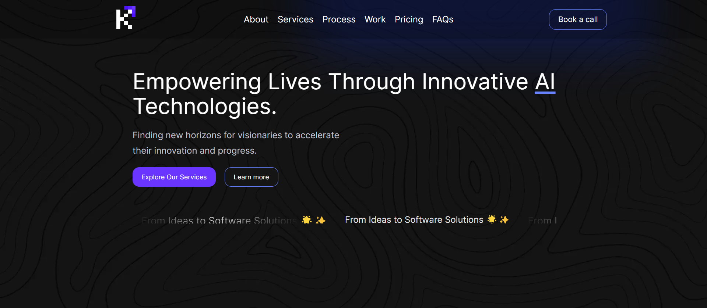

# KidJig

KidJig is a modern web application built with Next.js and Tailwind CSS, designed to empower lives through innovative AI technologies.

## Features

- Responsive design for various screen sizes
- Animated text marquee
- Gradient text effects
- Custom button styles

## Technologies Used

- [Next.js](https://nextjs.org/) - React framework for production
- [Tailwind CSS](https://tailwindcss.com/) - A utility-first CSS framework

## Getting Started

These instructions will get you a copy of the project up and running on your local machine for development and testing purposes.

### Prerequisites

- Node.js (version 12.0 or later)
- npm (usually comes with Node.js)

### Installation

1. Clone the repository:# KidJig

KidJig is a modern web application built with Next.js and Tailwind CSS, designed to empower lives through innovative AI technologies.

## Features

- Responsive design for various screen sizes
- Animated text marquee
- Gradient text effects
- Custom button styles

## Technologies Used

- [Next.js](https://nextjs.org/) - React framework for production
- [Tailwind CSS](https://tailwindcss.com/) - A utility-first CSS framework
- [React](https://reactjs.org/) - A JavaScript library for building user interfaces

## Getting Started

These instructions will get you a copy of the project up and running on your local machine for development and testing purposes.

### Prerequisites

- Node.js (version 12.0 or later)
- npm (usually comes with Node.js)

### Installation

1. Clone the repository: git clone https://github.com/Habib7442/kidjig-landing-page
2. Install the dependencies: npm install
   
### Running the Application

To run the development server: npm run dev